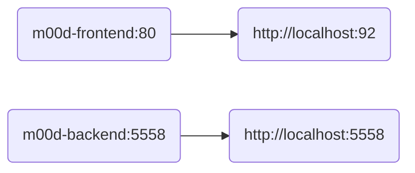

#  m00d

> - Mood tracker

---

### Docker Compose Flow: <!-- markdownlint-disable-line MD001 -->



---

### To build all images

```bash
./build.sh
```

---

### Additional documentation available

- [Frontend](./frontend/README.md "Frontend")
- [Backend](./backend/README.md "Backend")
