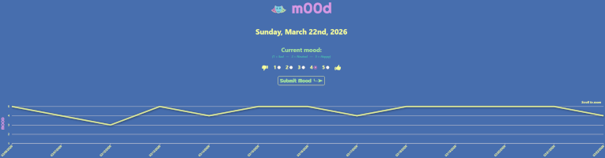
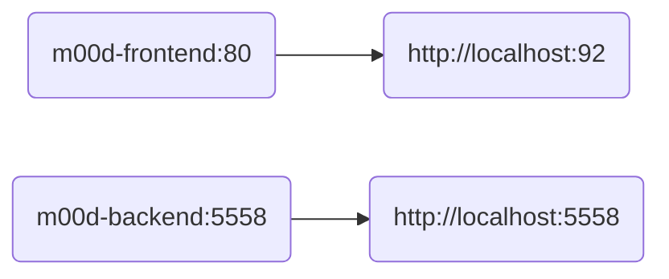

#  m00d

> - Mood tracker

---

### 📷 Screenshot <!-- markdownlint-disable-line MD001 -->



---

### 🔀 Docker Compose Flow



---

### 🛠️ Building

```bash
./build.sh
```

---

### ℹ️ Documentation

- [Frontend](./frontend/README.md "Frontend")
- [Backend](./backend/README.md "Backend")
